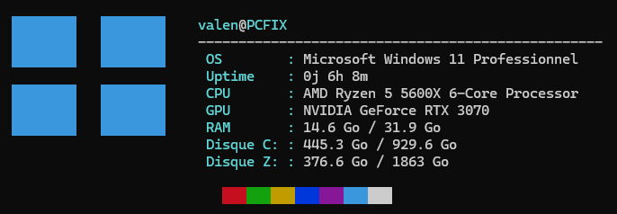

# Mini-Fetch PowerShell

Un clone ultra-léger et rapide de Neofetch écrit en pur PowerShell, sans dépendance externe.



## 📌 Fonctionnalités

- **Logo Windows 11** en art ASCII compatible UTF-8.
- **Détection matérielle :** Processeur (CPU), carte graphique dédiée (GPU filtré), mémoire vive (RAM utilisée/totale).
- **Stockage :** Détection dynamique de l'ensemble des disques fixes montés (C:, D:, etc.).
- **Palette ANSI :** Affichage des couleurs du terminal.

---

## 🚀 Installation rapide

### 1. Télécharger le script
Clone le dépôt ou télécharge directement le fichier `fetch.ps1` dans un dossier local :

```powershell
git clone https://github.com/FocheFR/mini-fetch-powershell.git "$HOME\Documents\mini-fetch-powershell"
```
### 2. L'exécuter automatiquement à l'ouverture du terminal

1. Autorise l'exécution des scripts locaux (si ce n'est pas déjà fait) :
```powershell
Set-ExecutionPolicy RemoteSigned -Scope CurrentUser
```
Ouvre ton profil de démarrage PowerShell et rentre :
```
if (!(Test-Path $PROFILE)) { New-Item -Path$PROFILE -Type File -Force }
notepad $PROFILE
```
Ajoute ces deux lignes tout en bas du fichier :
```
Clear-Host
& "$HOME\Documents\mini-fetch-powershell\fetch.ps1"
```
puis CTRL + S et ferme le Bloc notes
